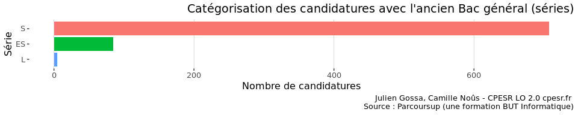
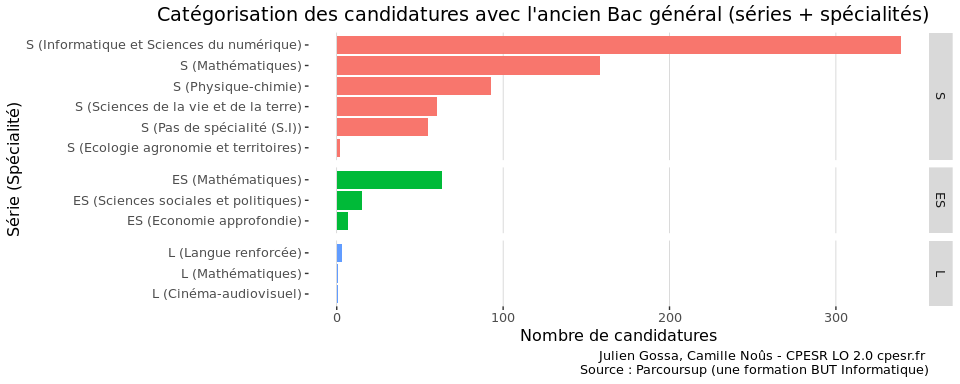
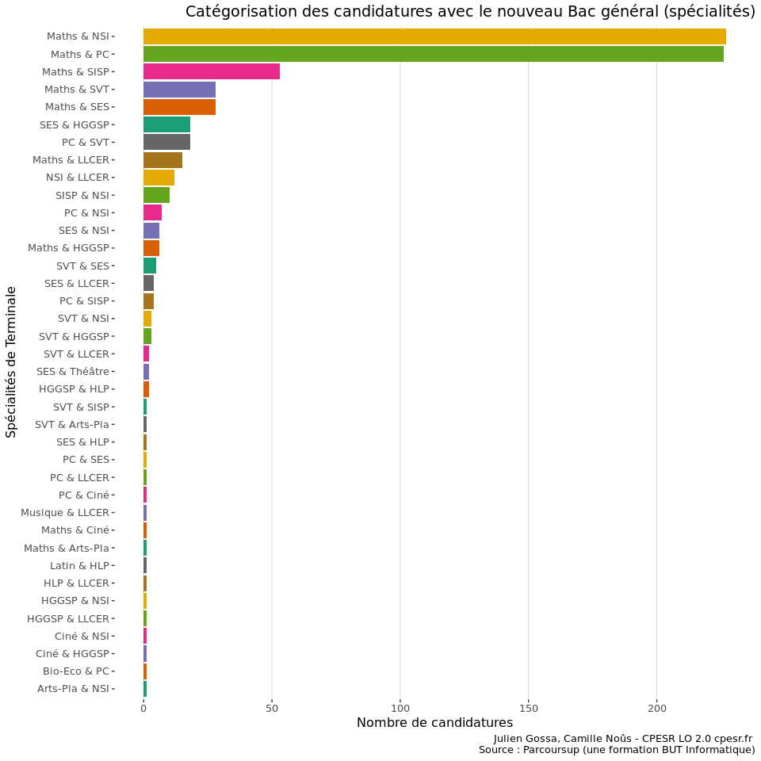
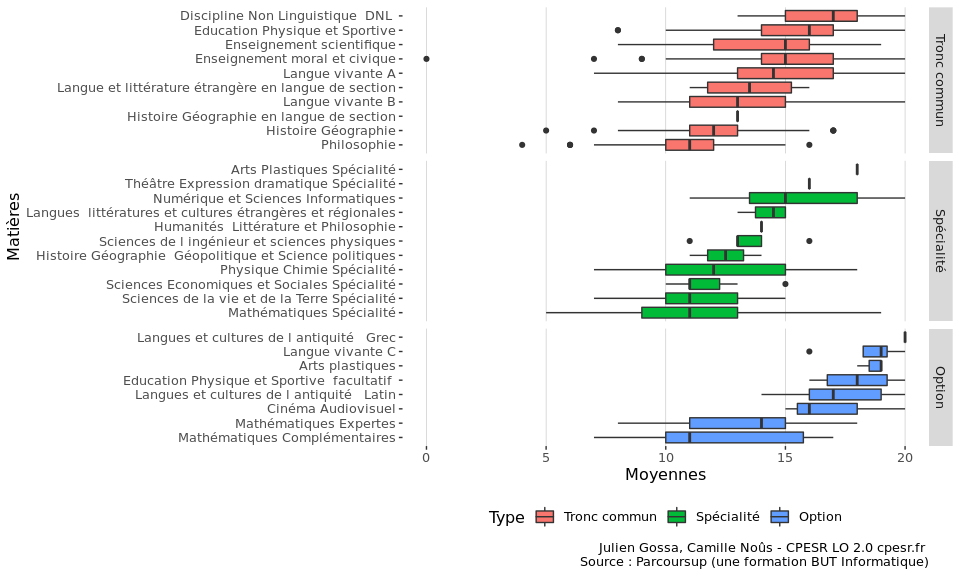
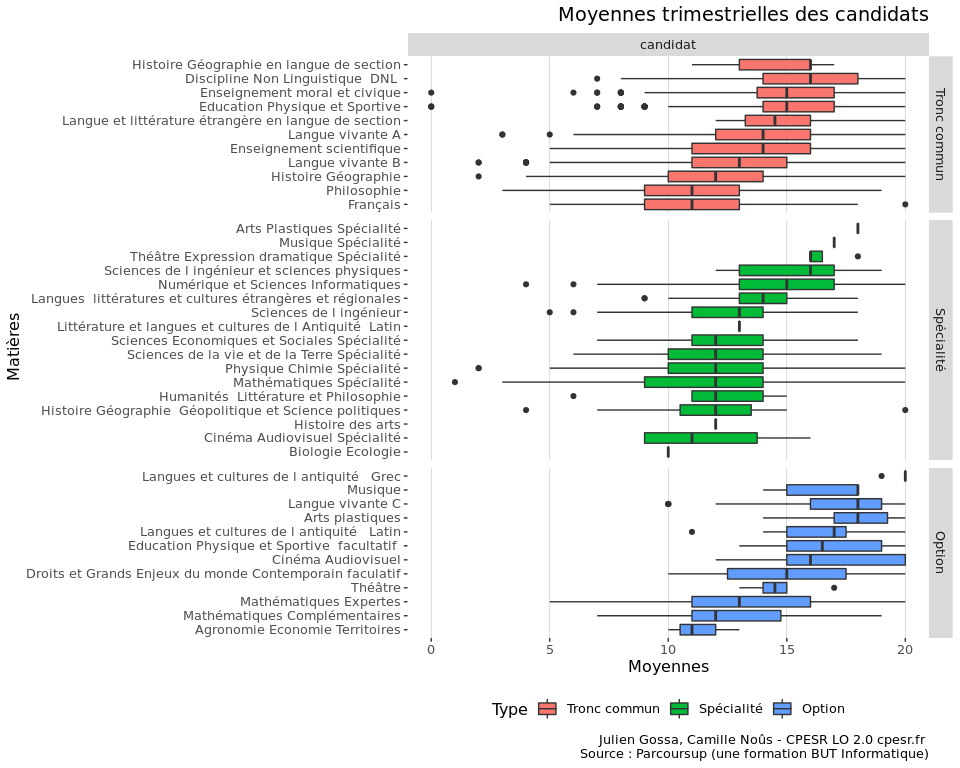
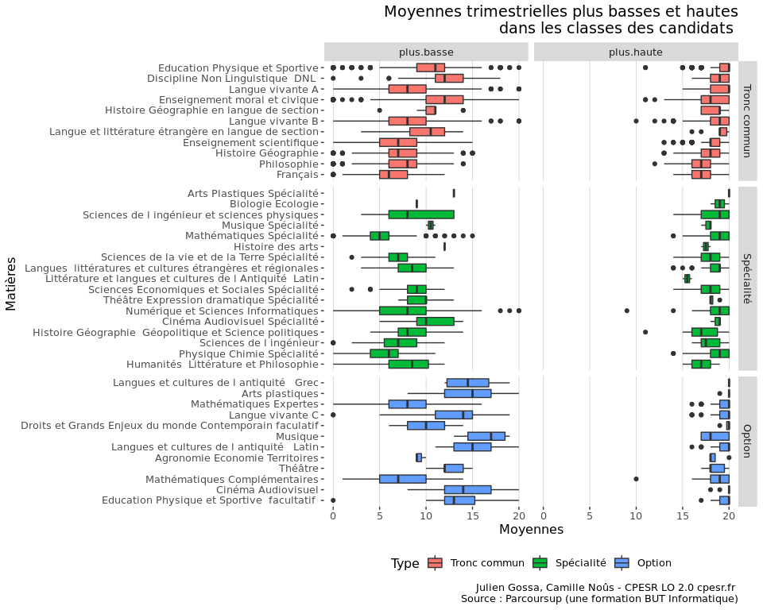

Spécialités
================

  - Nombre de groupes : 3
  - Taille des groupes : 5, 707

<!-- -->

  - Nombre de groupes : 12
  - Taille des groupes : 1, 339

<!-- -->

  - Nombre de groupes : 38
  - Taille des groupes : 1, 227

<!-- -->

  - Nombre de groupes : 105
  - Taille des groupes : 1, 133

<!-- -->

  - Nombre de groupes : 194
  - Taille des groupes : 1, 78

<!-- -->

## Notes

<!-- -->

<!-- -->

<!-- -->

<!-- -->
